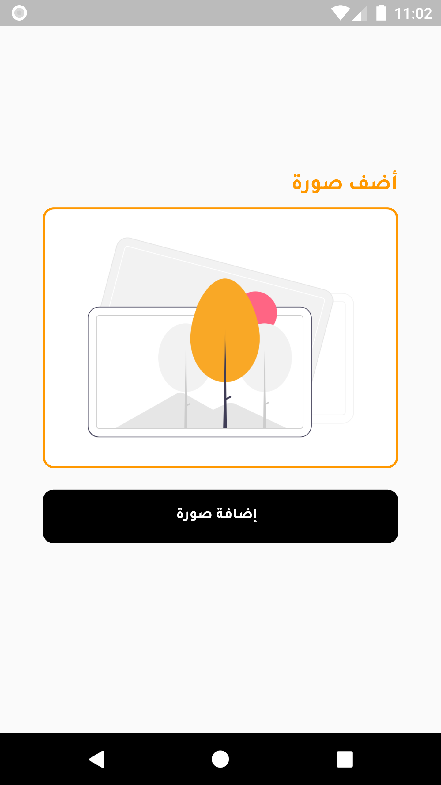
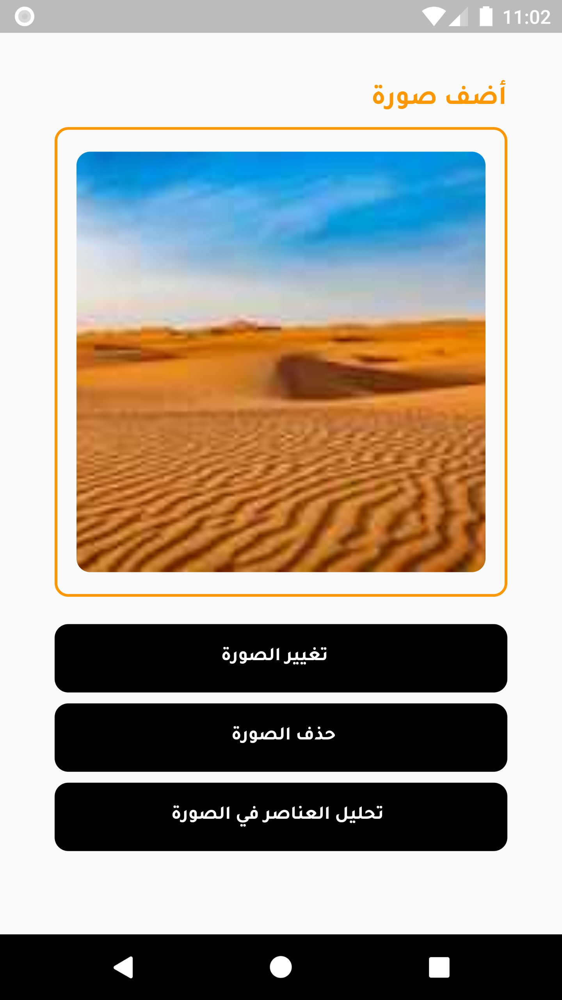
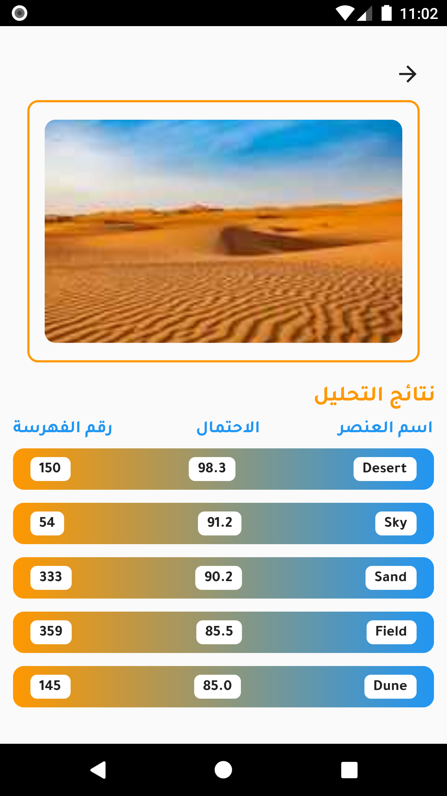

  
<!--    -->
  
  <h3 align="center">Image Items Identification</h3>

  

<!--     project to help Dash (the mascot of Flutter framework) in creating and sharing invitations with her friends :purple_heart:.
     
    <b>Contains</b>: converting widgets to an image with high resolution, besides localisation with two languages supported (Arabic & English).
     
    <b>Uses</b>: Riverpod as a state management solution.
     
    <em>(Submited as a part of Flutter Festival Challenge in KSA)</em>
      -->
    <a href="https://twitter.com/ReemNawaf">Twitter</a>
    ·
    <a href="https://www.linkedin.com/in/reemnawaf/">LinkedIn</a>
  

## Table of contents
- [To Start](#to-start)
- [screenshots](#screenshots)
- [Creator](#creators)

## To Start
This is a normal flutter app. You should follow the instructions in the [official documentation](https://flutter.io/docs/get-started/install).

https://user-images.githubusercontent.com/32703659/174162741-b21d643f-53c6-46e1-a26a-8dd12f58e04e.mp4

## Screenshots

   
  

    
    
    
  

   

## Creators
<a href="https://github.com/ReemNawaf">*Reem Almutairi*</a>

Enjoy :white_heart:☕:brain:
